## _SUMMARY:_

This week, the main thing students needed to understand was that BugHound is an agentic system, not just one AI response. It follows a workflow where it analyzes code, proposes a fix, checks the risk, and then decides whether the fix is safe enough to trust. I think students may struggle most with understanding fallback behavior, strict output formatting, and why a fix that looks reasonable can still be risky. AI was helpful for explaining the codebase, thinking through small reliability improvements, and helping plan test ideas. At the same time, AI was sometimes misleading because it often returned unusable output, and some suggestions sounded good at first but still needed to be checked carefully against the actual system behavior. One way I would guide a student without giving the answer is by asking them which exact step of the agent workflow they are changing and what behavior they expect to change after that edit.

---

### PART 1: Exploring the Agentic Workflow

Creating a virtual environment, installing requirements, and running the starter app:

python -m venv .venv
source .venv/Scripts/activate
pip install -r requirements.txt
streamlit run bughound_app.py

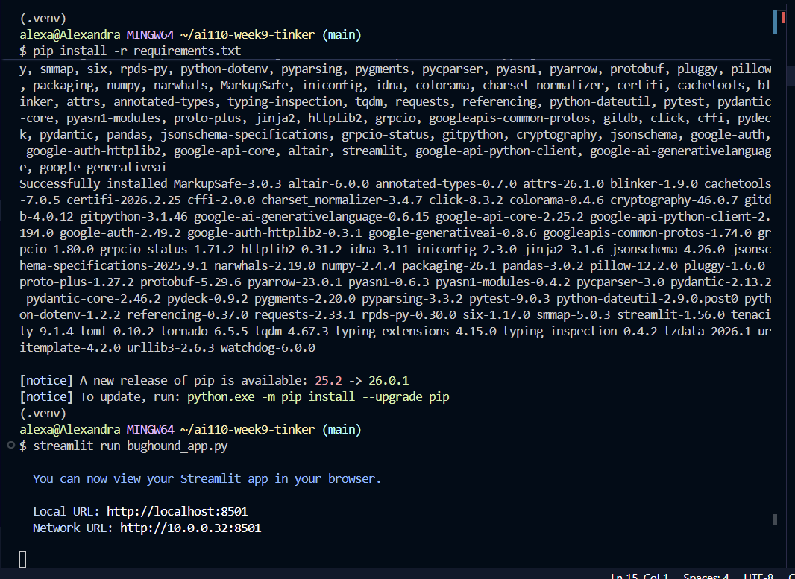

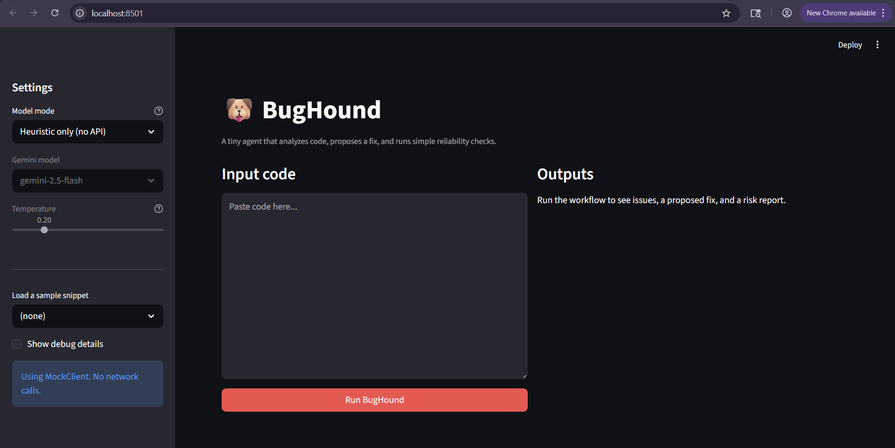

Testing sample code from sample_code folder using the Heuristic Mode only:

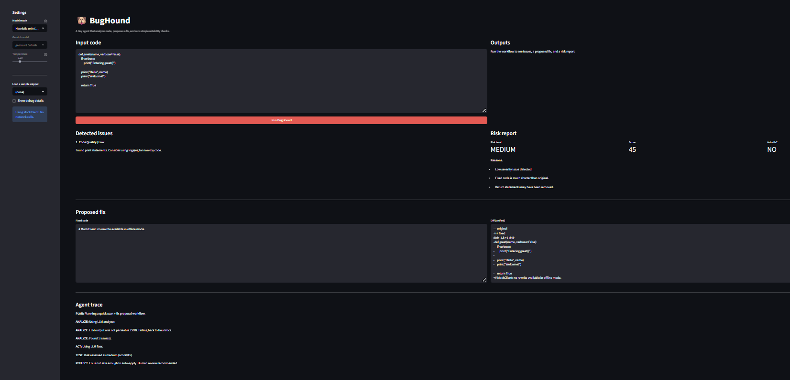

BugHound produced detected issues, a proposed fix, a risk report, and an agent trace

- Where does BugHound decide what problems exist in the code?

BugHound decides what problems are in the code during the Analyze step. In the Agent Trace, I saw that it first tried to use the LLM analyzer, but the output was not in the right JSON format, so it fell back to heuristics. After that, it still found one issue in the code.

- Where does it decide how to change the code?

BugHound decides how to change the code during the Act step. This is where it tries to make a proposed fix based on the issue it found.

- Where does it decide whether the change is safe?

BugHound decides whether the change is safe during the Test and Reflect steps. It gave the fix a medium risk score and then said the fix was not safe enough to auto-apply, so human review was recommended.

- What happens when the agent produces a result that feels incomplete or questionable?

When the result is incomplete or not in the expected format, BugHound does not fully trust it. In my run, it could not parse the analyzer output, so it fell back to heuristics. It also checked the risk of the fix before deciding whether it should be trusted.

Behavior that feels Unreliable:

One thing that felt unreliable was that the proposed fix was not really a real fix. It just showed a message saying MockClient: no rewrite available in offline mode. That feels more like a placeholder than an actual code change. The diff also showed that the fixed code was much shorter and may have removed important parts like the return statement, so I would not trust that fix without review.

### PART 2: Integrating an AI Analyzer

I looked at the prompt files in the starter project to understand what the AI model is expected to do. The analyzer prompts tell the model to act like a careful code analysis agent and return only valid JSON with a list of issues. The fixer prompts tell the model to return only the full rewritten Python code and to make the smallest and safest changes possible. This showed me that BugHound depends on the model following a strict format, not just giving a generally good answer. If the model output is not structured correctly, the system may not be able to use it and may need to fall back to heuristics.

After reviewing the prompt files, I created a Gemini API key and added it to a .env file so I could test BugHound in Gemini mode.

Testing the same sample code but with Gemini this time (print_spam.py):

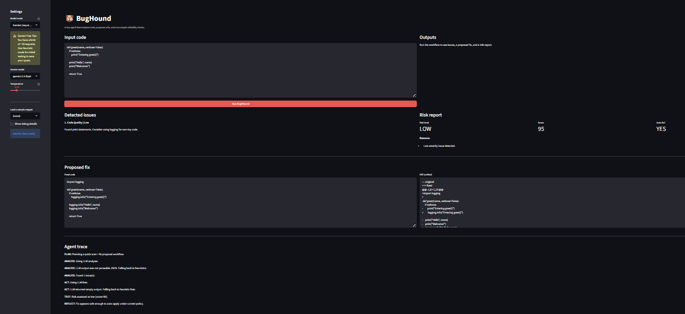

- How does the set of detected issues differ between Heuristic mode and Gemini mode?

In this run, the detected issue looked the same as before because the Gemini analyzer failed and the system fell back to heuristics. So the final issue detection was still based on the rule-based analyzer.

- Are there cases where the model output feels ambiguous or hard for the agent to interpret?

Yes. In this case, the analyzer output was not parseable JSON, which means the agent could not use it directly. The fixer also returned an empty output, which is another example of model output not being usable.

- What happens when the model output does not follow the expected structure exactly?

BugHound falls back to heuristics. In this run, it fell back during both the analysis step and the fix step. That allowed the workflow to continue even though the Gemini outputs were not usable.

Testing additional sample code (flaky_try_except.py):

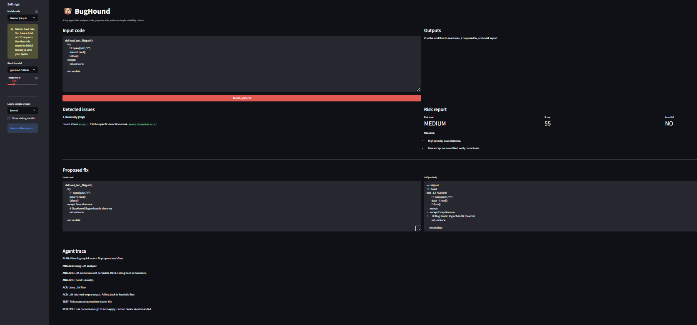

In this run, BugHound detected a high-severity reliability issue because the code used a bare except. The system proposed a safer version by changing it to a more specific exception handler. The risk report marked this fix as medium risk and did not allow auto-fix. Just like in my first Gemini test, the analyzer output was not parseable JSON, so the system fell back to heuristics, and the fixer also returned empty output, so it fell back again to the heuristic fixer.

This second test showed that BugHound can still complete the workflow even when Gemini output is not usable, because it has fallback logic. It also showed that different issues can lead to different risk decisions. The print statement fix was treated as low risk, but the bare except fix was treated as medium risk and required human review.

Comparing 2 tests:

The first test had a print statement issue. BugHound marked it as low severity, replaced print with logging.info, and gave it a low-risk score. It said the fix was safe enough to auto-fix.

The second test had a bare except issue. BugHound marked it as high severity, changed the exception handling to be more specific, and gave it a medium-risk score. It said the fix was not safe enough to auto-fix.

The main difference was the risk decision. The first fix was treated as safer because it was a smaller and less risky change. The second fix affected exception handling, which can change program behavior more easily, so BugHound was more cautious.

Making one intentional change to improve reliability in the analysis step:

PROMPT:

I need to make one small reliability improvement in the analysis step of BugHound. The analyzer prompt expects each issue to have type, severity, and msg. Right now the agent may accept incomplete issue objects by filling in default values. Help me think through the impact of making the analyzer stricter so it only accepts issue objects that include all three required fields.

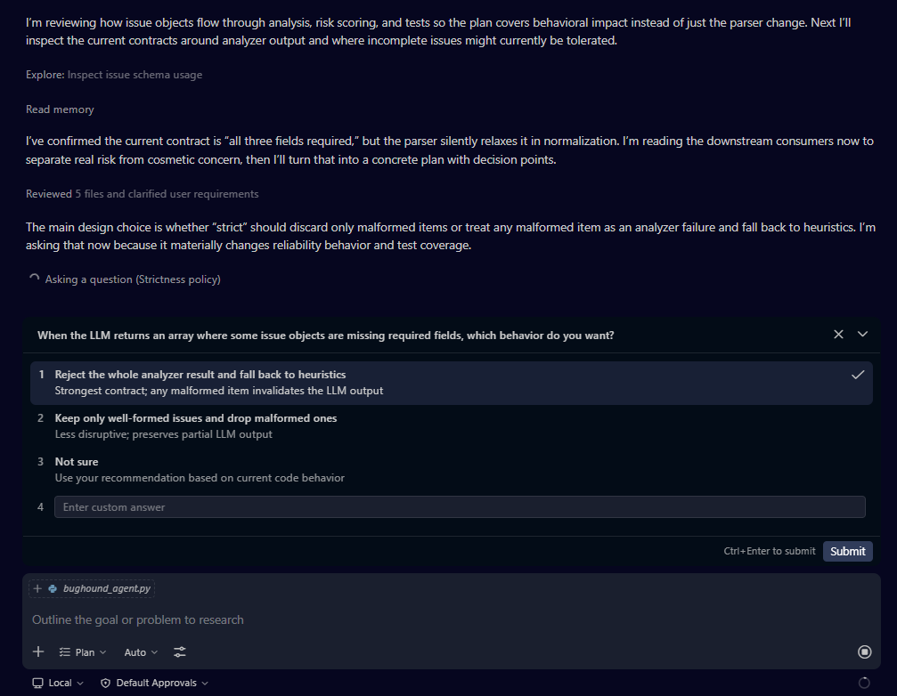

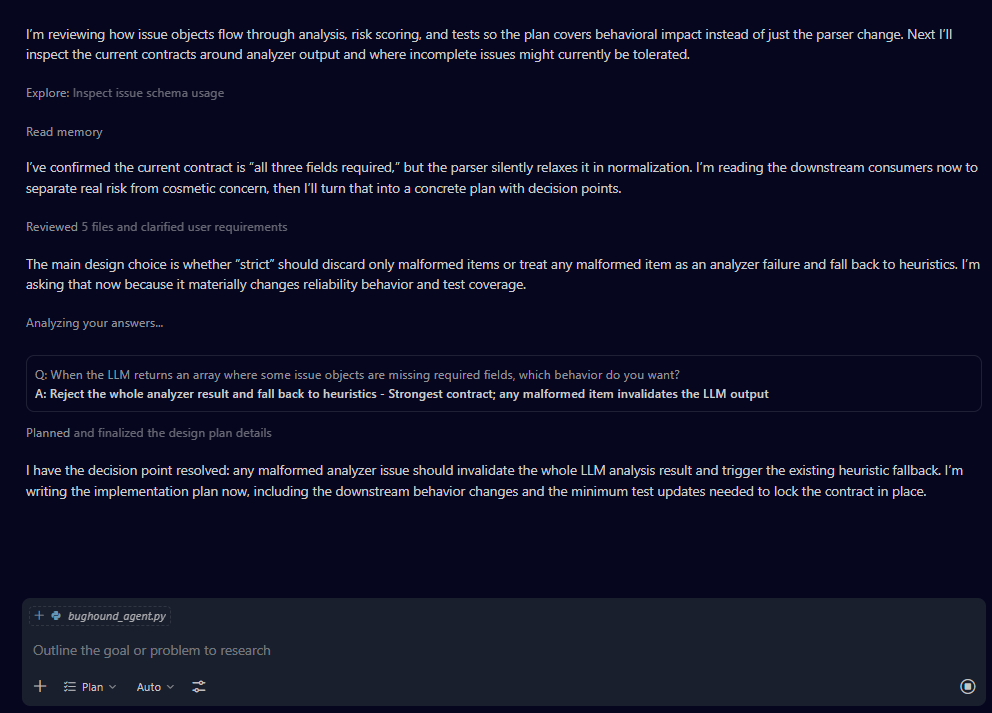

I made the analysis step stricter by changing how BugHound handles AI-generated issues. Before, it would accept issue objects even if they were missing fields and would fill in default values. After my change, if even one issue object is malformed or missing type, severity, or msg, the system rejects the whole analyzer result and falls back to heuristics.

I made this change because the analyzer prompt clearly expects every issue to include all three fields. If the AI output does not follow that contract, the system should treat it as unreliable instead of partly trusting it.

I expected this change to make BugHound more careful when accepting AI output and improve reliability in the analysis step.

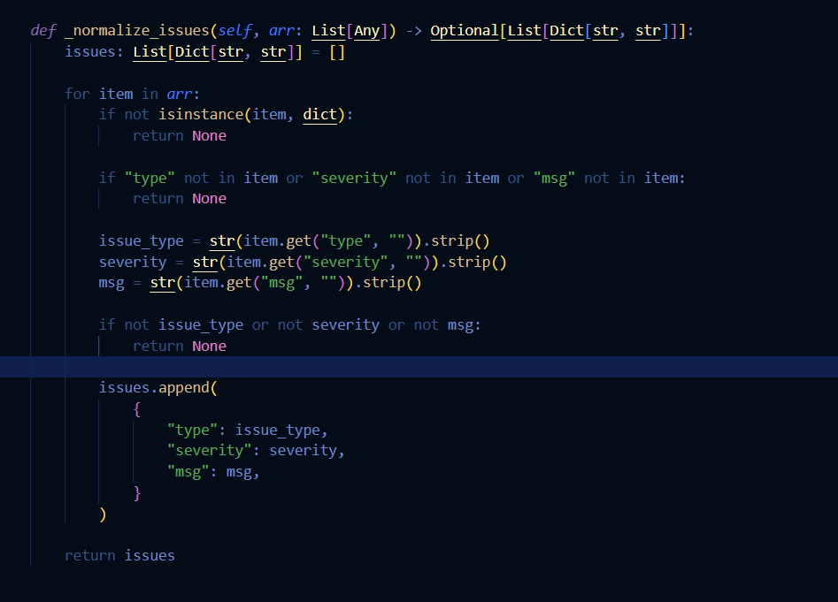

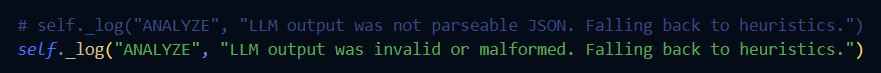

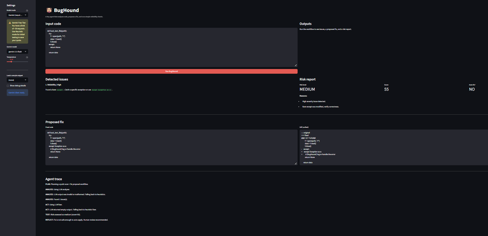

After rerunning BugHound on the same input, the overall result was similar, but the Agent Trace now shows a clearer and stricter reliability rule. Instead of only saying the output was not parseable JSON, it now says the LLM output was invalid or malformed and then falls back to heuristics. This shows that the analysis step is now more strict about what it accepts from the model.

---

### PART 3: Proposing Fixes and Evaluating Risk

PROMPT: Examining propose_fix method

Explain the propose_fix method in simple words. Show me how BugHound decides between heuristic fixes and LLM fixes, and how it handles empty or failed fixer output.

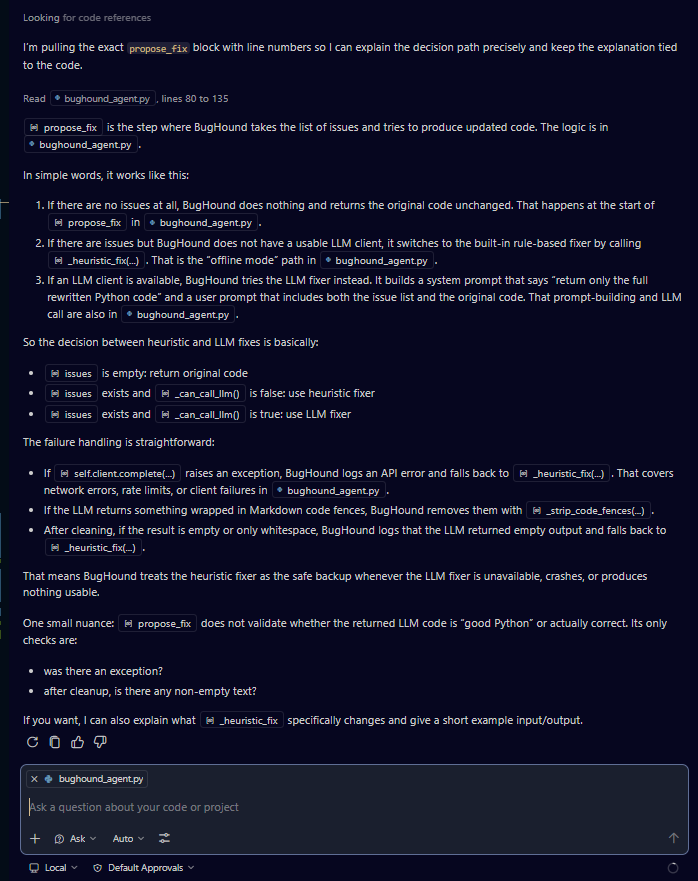

The propose_fix method is the step where BugHound tries to rewrite the code after finding issues. If there are no issues, it leaves the code unchanged. If the LLM is unavailable or fails, BugHound falls back to the heuristic fixer. It also falls back if the LLM returns empty output. This means the system does not fully trust the fixer and keeps a safer backup path.

PROMPT: Understanding risk_assessor.py

Explain reliability/risk_assessor.py in simple words. What rules are used to score risk, and what makes a fix more or less likely to be auto-applied?

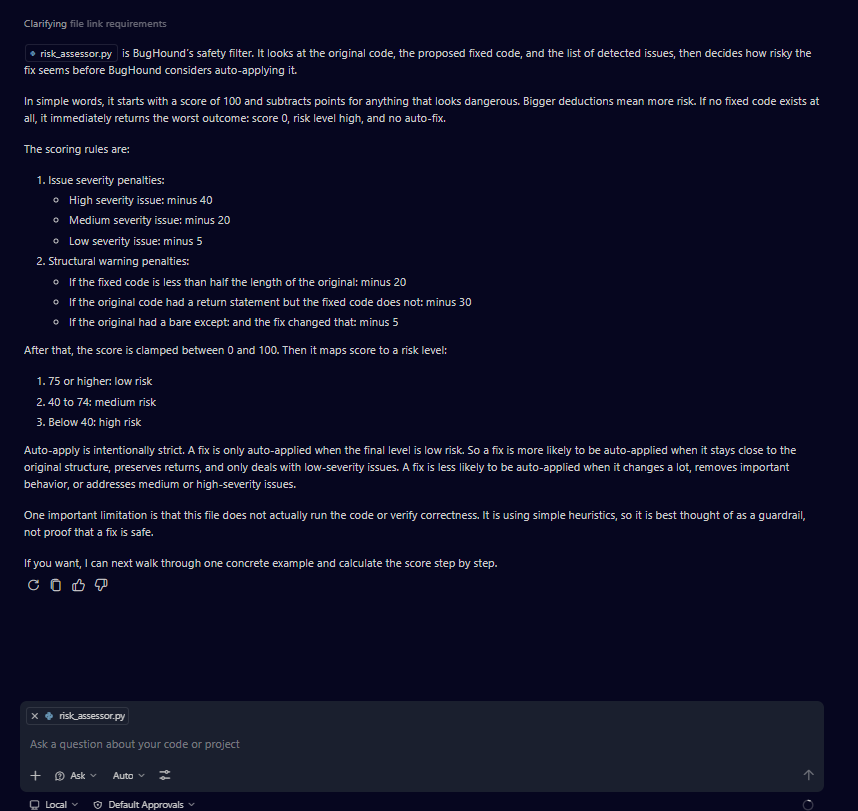

The risk assessor acts like a guardrail after BugHound proposes a fix. It starts with a score of 100 and subtracts points for things that look risky, such as high-severity issues, large structural changes, or possible behavior changes. Then it maps the final score to a low, medium, or high risk level. A fix is only auto-applied when the final result is low risk. This makes the system more cautious before acting automatically.

What guidance is given about preserving behavior and minimizing changes?

The fixer prompt tells BugHound to preserve behavior whenever possible and make the smallest changes needed. This means the model is supposed to avoid rewriting too much and should try to keep the original code working the same way.

What assumptions does the agent make about the format of the model's response?

The agent assumes the model will return only the full rewritten Python code, with no markdown or extra explanation. If the response is empty or unusable, the system falls back to the heuristic fixer.

Testing code with multiple issues now (mixed_issues.py) in Gemini mode:

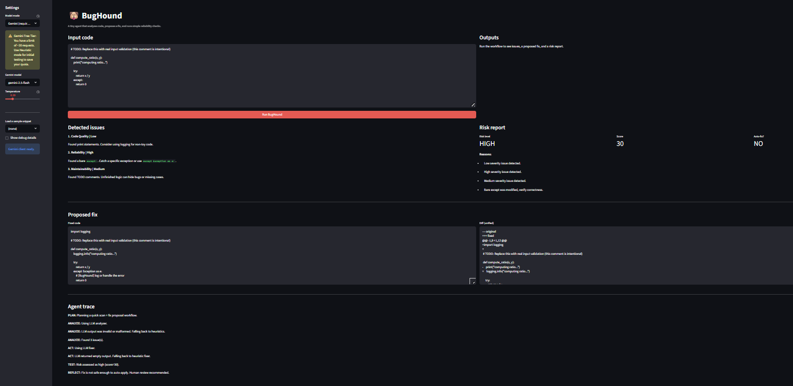

- Did the fix change more than you expected?

The fix was still fairly targeted because it only changed the lines related to the issues. It replaced the print statement with logging, changed the bare except, and added a comment. It did not rewrite the whole function, but the exception-handling change is still important.

- Did it alter behavior in subtle ways?

Yes. The biggest subtle change was the exception handling. Changing except: to except Exception as e: can affect which errors are caught and how the function behaves in some cases. That makes it riskier than a simple logging change.

- Would you feel comfortable merging this change without review?

No. I would want human review before merging it because it changes exception handling, which can affect program behavior.

Conservative rules (cautious):

- high severity issue: minus 40
- medium severity issue: minus 20
- return removed: minus 30
- auto-fix only if level == "low"

These make BugHound careful, especially when the fix touches important behavior.

Possibly overly permissive rule:

- changing exception handling that can affect real behavior (but it only subtracts 5 points).

PROMPT: making a small change

I need to make one very small change to BugHound’s risk assessment logic so it becomes a little more cautious. In risk_assessor.py, changing a bare except currently only subtracts 5 points. Help me think through the effect of increasing that penalty slightly so fixes that change exception handling are treated more cautiously.

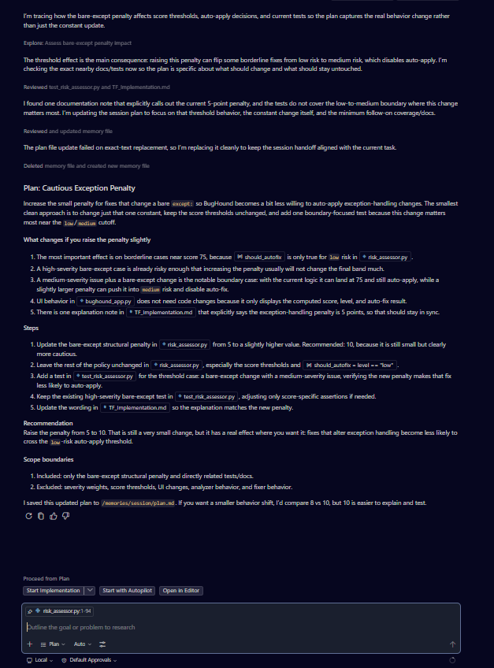

Implementing changes based on Copilot's plan but with some adjustments:

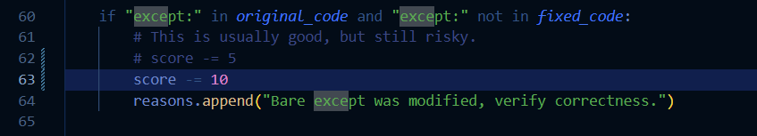

Testing mixed_issues again:

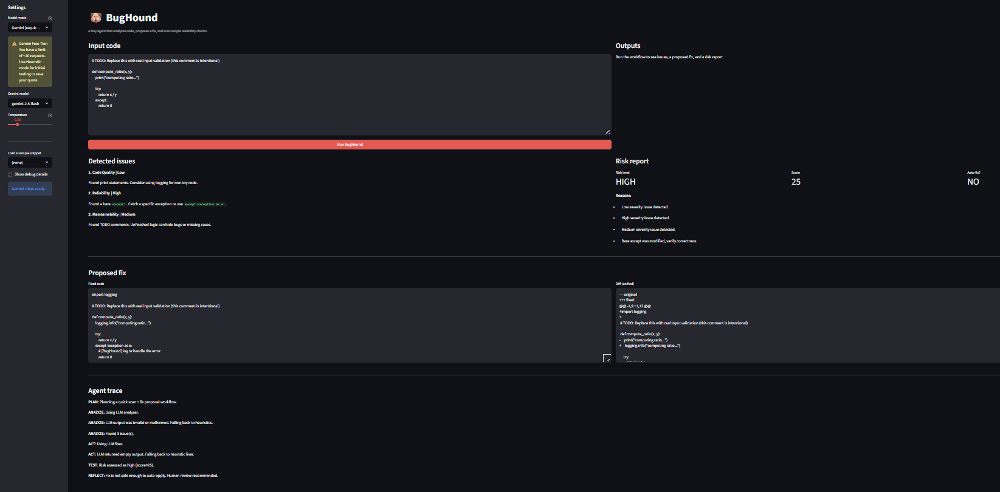

I traced how BugHound proposes fixes and how it uses risk_assessor.py to decide whether those fixes are safe enough to trust. I tested it on mixed_issues.py, which contains multiple issues, and I noticed that the proposed fix was fairly focused but still changed exception handling, which can affect behavior in subtle ways. Some of the existing rules already felt conservative, especially the large penalties for high-severity issues and the strict auto-fix policy. However, the penalty for changing a bare except block felt a little too permissive, so I made one small change to increase that penalty from 5 to 10. After rerunning the same input in Gemini mode, the score dropped from 30 to 25, showing a small but meaningful shift toward caution.

---

### PART 4: Testing, Reliability, and Guardrails

running pytest first

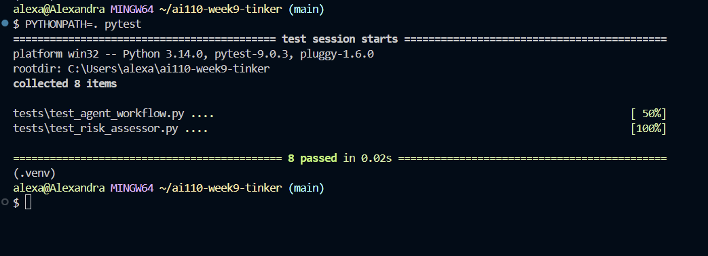

When I first ran pytest, the tests failed during collection because Python could not find the project modules like bughound_agent and reliability. This was not a bug in the app logic itself. It was an import path issue. I fixed it by running PYTHONPATH=. pytest, and after that all 8 tests passed.

The tests are checking the workflow and reliability behavior, not just whether the UI opens. They help confirm that BugHound’s fallback logic and risk rules still work as expected after changes.

We already tested mixed_issues.

Next, we'll test cleanish,py:

I tested BugHound on cleanish.py, which is a file that should mostly be left alone. BugHound behaved reasonably in this case. It did not create false positives, it left the code unchanged, and it gave the result a low-risk score of 100. This was a good sign because it showed the system can avoid unnecessary changes on cleaner input.

Now, testing a weird case (providing only comments):

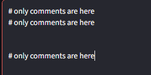

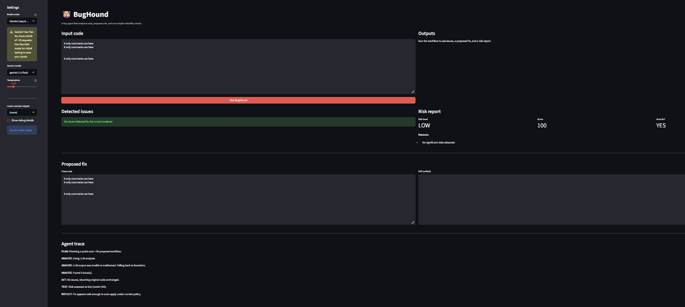

BugHound also handled the comments-only input safely. It did not hallucinate issues, did not propose weird changes, and left the content unchanged with a low-risk score of 100.

PROMPT: Adding additional test

I found a failure mode in BugHound where the LLM analyzer returns invalid or malformed output, so the system needs to fall back to heuristics. Help me design one small test in test_agent_workflow.py using the MockClient pattern to verify that malformed analyzer output triggers heuristic fallback instead of being accepted.

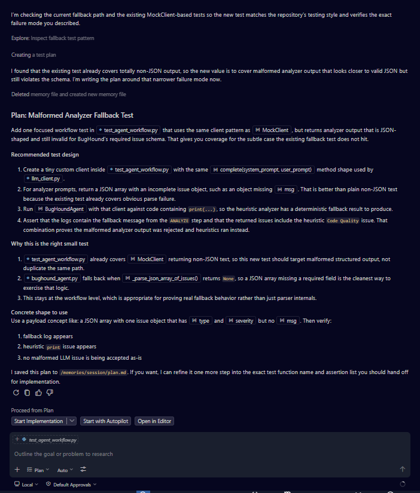

Adding another test to test_agent_workflow based on Copilot's suggestions:

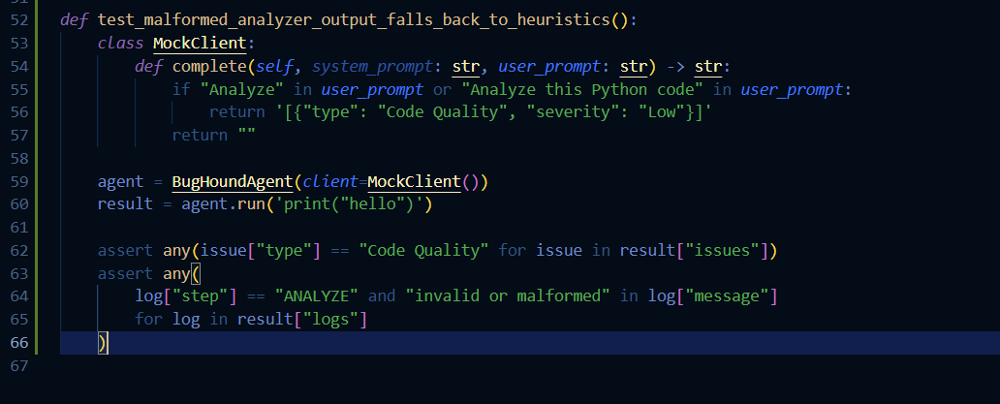

Running pytest again to make sure it works:

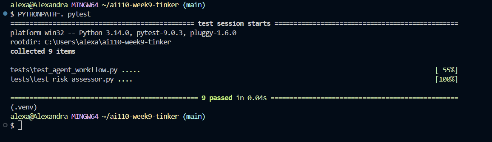

I tested BugHound on three different kinds of input: a mostly clean file, a buggy file with multiple issues, and a weird comments-only input. The clean and weird cases were handled safely, but across multiple Gemini-mode runs I noticed that the LLM analyzer often returned unusable output, so the system relied heavily on fallback behavior. I decided this failure mode belonged in the agent workflow because it happens during analysis before risk scoring. To strengthen that guardrail, I added a test in test_agent_workflow.py that checks whether malformed analyzer output is rejected and replaced with heuristic fallback. After rerunning the tests with PYTHONPATH=. pytest, all 9 tests passed.

### PART 5: Reflection was written throughout this file/doc
